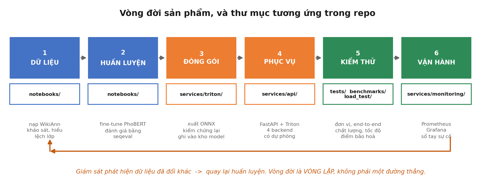

# NLP Ops Basic

Một hệ thống **nhận diện thực thể có tên (NER) tiếng Việt** đi hết vòng đời sản
phẩm AI: dữ liệu → huấn luyện → đóng gói → phục vụ → kiểm thử → vận hành.

Không dừng ở "train xong model". Có API với hợp đồng rõ ràng, giao diện, cơ chế dự
phòng, hai bộ chấm điểm, đo tải, bảng giám sát, và sổ tay xử lý sự cố.


| Tài liệu                                                | Nội dung                                          |
| --------------------------------------------------------- | -------------------------------------------------- |
| [docs/SETUP_LINUX.md](docs/SETUP_LINUX.md)                 | Cài đặt.**Đọc trước**                 |
| [docs/SETUP_WINDOWS_MACOS.md](docs/SETUP_WINDOWS_MACOS.md) | Chỗ khác đi trên Windows, macOS                |
| [docs/SETUP_VASTAI.md](docs/SETUP_VASTAI.md)               | Thuê GPU theo giờ (4 tới 8 GB VRAM là đủ)    |
| [docs/ARCHITECTURE.md](docs/ARCHITECTURE.md)               | Vì sao thiết kế như vậy                       |
| [docs/API_CONTRACT.md](docs/API_CONTRACT.md)               | Hợp đồng API cho người tích hợp             |
| [docs/TRAINING.md](docs/TRAINING.md)                       | Huấn luyện, kể cả trên Google Colab           |
| [benchmarks/README.md](benchmarks/README.md)               | Chấm điểm chất lượng và cách đọc con số |
| [docs/LOAD_TESTING.md](docs/LOAD_TESTING.md)               | Đo tải, tìm điểm bão hoà                    |
| [docs/MONITORING.md](docs/MONITORING.md)                   | Đọc bảng giám sát, đặt cảnh báo           |
| [docs/TROUBLESHOOTING.md](docs/TROUBLESHOOTING.md)         | 12 lỗi thật, kèm cách chẩn đoán             |

---

## 1. Hệ thống làm gì

```bash
curl -X POST http://localhost:8080/v1/ner \
     -H "Content-Type: application/json" \
     -d '{"text": "Nguyễn Bá Thiêm làm việc tại Google ở Hà Nội."}'
```

```json
{
  "model": "phobert-ner-gpu", "runtime": "triton-gpu", "latency_ms": 7.8,
  "entities": [
    { "text": "Nguyễn Bá Thiêm", "label": "PER", "start": 0,  "end": 15 },
    { "text": "Google",          "label": "ORG", "start": 29, "end": 35 },
    { "text": "Hà Nội",          "label": "LOC", "start": 38, "end": 44 }
  ]
}
```

**Cùng một endpoint chạy được nhiều model, chọn bằng một trường `model`.** Tên
model tự host thì chạy tại chỗ, tên nào khác thì tự đẩy sang nhà cung cấp LLM:

| model                  | Chạy ở đâu                                                        |
| ---------------------- | --------------------------------------------------------------------- |
| `phobert-ner-gpu`    | Triton, GPU. Mặc định                                              |
| `phobert-ner-cpu`    | Triton, CPU. Cùng file trọng số, để đo chênh lệch phần cứng |
| `phobert-ner-local`  | ONNX Runtime trong tiến trình API. Dự phòng khi Triton hỏng      |
| `groq/compound`, ... | nhà cung cấp LLM                                                    |

---

## 2. Chạy trong 5 bước

Cần: Docker Compose v2, ~25 GB đĩa. GPU khuyến nghị chứ không bắt buộc.

```bash
bash scripts/build_triton_image.sh    # MỘT LẦN, 15-30 phút. Không muốn chờ thì
                                      # echo "TRITON_IMAGE=nvcr.io/nvidia/tritonserver:24.12-py3" >> .env
jupyter notebook notebooks/01_train_ner.ipynb   # huấn luyện, ~10 phút trên RTX 3090
cp .env.example .env                  # tuỳ chọn: điền GROQ_API_KEY cho phần đối chứng
docker compose up -d
python3 tests/test_pipeline.py        # 15 phép kiểm, phải qua hết
```

|                  | Địa chỉ                 |
| ---------------- | -------------------------- |
| Trang demo       | http://localhost:8080      |
| Tài liệu API   | http://localhost:8080/docs |
| Bảng giám sát | http://localhost:3001      |

Cổng bị chiếm thì đổi trong `.env`, không cần sửa `docker-compose.yml`.

---

## 3. Bốn dịch vụ

| Thành phần         | Cổng      | Vai trò                                                                              |
| -------------------- | ---------- | ------------------------------------------------------------------------------------- |
| **FastAPI**    | 8080       | xác thực, kiểm tra đầu vào, tokenize, hậu xử lý, giao diện                  |
| **Triton**     | 8000, 8002 | chạy ONNX, gộp batch động, xuất số đo                                          |
| **Prometheus** | 9490       | thu số đo từ**cả hai** lớp: Triton `:8002` và FastAPI `:8080/metrics` |
| **Grafana**    | 3001       | bảng giám sát dựng sẵn                                                           |

**Vì sao tách FastAPI với Triton:** Triton chỉ nhận tensor, nó không biết bạn là
ai và không biết chữ là gì. Ngược lại FastAPI tự nạp model thì không có gộp batch,
GPU rảnh phần lớn thời gian. Chi tiết: [docs/ARCHITECTURE.md](docs/ARCHITECTURE.md).

**Dự phòng.** Triton hỏng thì API không sập, tự chuyển sang chạy ONNX trong tiến
trình. Response ghi `meta.fallback_from`, `/health` chuyển `degraded`. Thử:

```bash
docker compose stop triton
curl -s -X POST localhost:8080/v1/ner -H 'Content-Type: application/json' \
     -d '{"text":"Nguyễn Bá Thiêm làm việc tại Google ở Hà Nội."}' | python3 -m json.tool
docker compose start triton
```

---

## 4. Kết quả đo được

Tất cả đo trên RTX 3090 bằng chính các script trong repo.

### Chất lượng: hai bộ dữ liệu, hai câu chuyện ngược nhau

|                     | WikiAnn test(tập model được học) | Văn bản giống ngoài đời |
| ------------------- | ------------------------------------- | ----------------------------- |
| `phobert-ner-gpu` | **0,808**                       | 0,774                         |
| `groq/compound`   | **0,436**                       | **0,962**               |

Cả hai cột đều chấm trên **đúng cùng một tập câu**: 150 câu WikiAnn lấy mẫu cố
định (seed 0), và 26 câu viết tay. Riêng model tự host còn được chấm trên **toàn
bộ 10.000 câu** của tập test WikiAnn, đạt F1 **0,879**.

LLM thắng đậm ở bộ này và thua đậm ở bộ kia. **Lý do không nằm ở model.**

WikiAnn được xây dựng **tự động** từ liên kết Wikipedia, không phải người gán
nhãn. Nhãn của nó mang quy ước riêng và cả nhiễu: `Giao thức TCP / IP` được gán
PER, `Ưng ngỗng nâu` gán LOC, `Vùng đô thị` gán ORG. Model tự train học đúng
những quy ước đó vì nó được huấn luyện trên chính bộ này; LLM áp dụng ngữ nghĩa
đời thực nên bị chấm là sai dù câu trả lời hợp lý hơn.

**Bài học dùng được cho mọi dự án:** điểm trên tập test đo *mức khớp với quy ước
gán nhãn*, không đo *độ đúng*. Trước khi tin một con số F1, hãy mở vài chục câu
của tập test ra đọc. Chi tiết: [benchmarks/README.md](benchmarks/README.md).

> Bộ 26 câu được sinh ra trong lúc dựng repo bằng công cụ AI, **không qua kiểm
> chứng chéo bởi người gán nhãn độc lập**. Nó dùng để soi dạng lỗi, không dùng để
> công bố năng lực model.

### Model có bền không? Không

Bốn nhóm yếu nhất trong tám nhóm tình huống:

| Nhóm                                                          | Tự host        | LLM   |
| -------------------------------------------------------------- | --------------- | ----- |
| chữ viết thường (`nguyễn văn a sống ở đà nẵng`)   | **0,000** | 1,000 |
| bẫy danh từ chung (`công ty công nghệ`, `trung tâm`) | 0,667           | 1,000 |
| đoạn dài, tên nhắc lại lần hai                          | 0,769           | 1,000 |
| tên tổ chức dài                                            | 0,800           | 0,800 |

F1 bằng 0 ở nhóm viết thường là hỏng hoàn toàn, không phải yếu. Dữ liệu huấn
luyện quá "sạch" so với tin nhắn và bình luận ngoài đời.

Nhóm **tên tổ chức** là nhóm duy nhất mà LLM cũng chỉ đạt 0,800: đó là điểm khó
của chính bài toán, không phải của riêng model nào. Tính theo nhãn thì ORG cũng
là loại yếu nhất của model tự host (F1 0,703 so với PER 0,889).

### Throughput và latency

|                     | Latency p50, gọi lẻ | 100 user đồng thời, 70 giây                                                  |
| ------------------- | --------------------- | -------------------------------------------------------------------------------- |
| `phobert-ner-gpu` | 7,9 ms                | throughput**316 req/s** — latency p50 9 ms, p90 14 ms, p99 35 ms, 0% lỗi |
| `phobert-ner-cpu` | 17,8 ms               | throughput 66 req/s — latency p50 1200 ms, p90 1400 ms, p99 1500 ms, 0% lỗi    |
| `groq/compound`   | 3660 ms               | không đo (tính tiền theo lượt gọi)                                        |

Latency ở đây là **phân vị đo phía client bằng Locust** (đã gồm cả đường mạng và
thời gian FastAPI xử lý), không phải trung bình. Cột trái là p50 của phép chấm
điểm chất lượng, mỗi câu gọi 3 lần.

**Gọi lẻ thì GPU chỉ nhanh hơn CPU 2,3 lần. Dưới 100 người dùng đồng thời, GPU
nhanh hơn 133 lần về latency p50 và throughput cao hơn 4,8 lần.** Vì CPU đã bão
hoà: request không biến mất mà xếp hàng. Đó là lý do không ước lượng được năng
lực hệ thống bằng cách nhân con số đo một request lên.

---

## 5. Cấu trúc thư mục

```
nlp-ops-basic/
├── notebooks/       [1-2] dữ liệu, huấn luyện, đánh giá, xuất ONNX
├── services/
│   ├── api/         [4]   lớp ứng dụng: core/ backends/ routers/
│   ├── triton/      [3]   kho model, đánh phiên bản bằng thư mục
│   └── monitoring/  [6]   Prometheus + Grafana, cấu hình dạng file
├── benchmarks/      [5]   chấm điểm chất lượng, hai bộ dữ liệu
├── load_test/       [5]   đo tải bằng Locust
├── tests/           [5]   kiểm thử đơn vị (không cần Docker) và end-to-end
└── docs/
```

Số trong ngoặc là giai đoạn trong vòng đời. Mỗi thư mục ứng với một giai đoạn.



---

## 6. Học theo thứ tự nào

| Bước | Việc                                               | Hiểu được gì                                               |
| ------ | --------------------------------------------------- | --------------------------------------------------------------- |
| 1      | `docker compose up -d`, mở http://localhost:8080 | hệ thống làm gì                                             |
| 2      | Đọc notebook tới**mục 8**                 | model từ đâu ra, và lỗi tiền xử lý nguy hiểm thế nào |
| 3      | Đọc`services/api/app/core/`                     | phần dễ sai nhất, vì sao tách riêng                       |
| 4      | `python3 tests/test_units.py`                     | test rẻ nhất bắt được gì (không cần Docker)            |
| 5      | Đọc`services/api/app/backends/`                 | một endpoint chạy nhiều model lõi ra sao                    |
| 6      | Chạy cả hai bộ chấm điểm                      | vì sao con số F1 có thể lừa mình                          |
| 7      | Mở Grafana rồi chạy đo tải                     | điểm bão hoà, nhìn thấy trực tiếp                       |
| 8      | Dừng Triton rồi gọi API                          | cơ chế dự phòng hoạt động ra sao                         |

Bước 2, 6 và 8 đáng giá nhất và cũng hay bị bỏ qua nhất.

---

## 7. Trong thực tế thì khác gì

Repo này gom mọi thứ vào một chỗ để học hết vòng đời trong một lần đọc. Sản phẩm
thật thường tách thành bốn repo theo đúng ranh giới thư mục hiện có, vì bốn phần
đó thay đổi theo bốn nhịp khác nhau và do bốn nhóm khác nhau chịu trách nhiệm.
Chi tiết: [docs/ARCHITECTURE.md](docs/ARCHITECTURE.md).

Ba khác biệt nữa: trọng số đi qua model registry chứ không qua Git; notebook chạy
ở nơi khác nơi phục vụ (bản này chạy được trên Colab và tự đóng gói `.zip` cho bạn
tải về); và phải có xác thực trước khi mở ra Internet.

---

## 8. Bảo mật

- `.env` chứa API key và **đã nằm trong `.gitignore`**. Trước lần push đầu tiên,
  chạy `git status` và tự mắt kiểm tra danh sách file.
- Trọng số (`*.onnx`) cũng không commit: nặng, và sinh lại được bằng notebook.
- **Hệ thống này CHƯA CÓ xác thực.** Mọi endpoint đều mở. Trước khi đưa ra
  Internet phải thêm ít nhất: xác thực, giới hạn tần suất theo người gọi, CORS
  khai báo tường minh.
- Grafana đang cho xem không cần đăng nhập cho tiện khi học. Tắt trước khi dùng thật.
