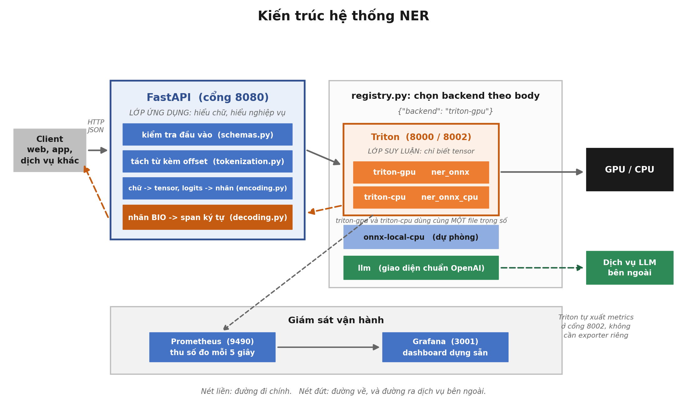

# Kiến trúc



| Dịch vụ            | Cổng      | Vai trò                                                             |
| -------------------- | ---------- | -------------------------------------------------------------------- |
| **Triton**     | 8000, 8002 | chạy model, gộp batch, xuất số đo                               |
| **FastAPI**    | 8080       | xác thực, kiểm tra đầu vào, tokenize, hậu xử lý, giao diện |
| **Prometheus** | 9490 | thu số đo từ Triton `:8002` VÀ FastAPI `:8080/metrics` |
| **Grafana**    | 3001       | hiển thị số đo                                                   |

---

## Vì sao tách hai lớp FastAPI và Triton

|                                    | Chỉ FastAPI tự nạp model | Chỉ Triton      | Cả hai |
| ---------------------------------- | --------------------------- | ---------------- | ------- |
| Xác thực, lọc đầu vào        | có                         | **không** | có     |
| Đổi chữ thành số              | có                         | **không** | có     |
| Gộp batch động                  | **không**            | có              | có     |
| Phục vụ nhiều phiên bản model | **không**            | có              | có     |
| Xuất số đo sẵn                 | **không**            | có              | có     |

Ranh giới rất rõ: **Triton không bao giờ nhìn thấy một ký tự nào.** Mọi thứ liên
quan tới ngôn ngữ (tokenizer, bảng nhãn, gom span) nằm ở lớp ứng dụng. Nhờ vậy
đổi Triton sang TorchServe hay vLLM chỉ phải viết lại một file trong
`app/backends/`.

---

## Đường đi của một request

```
1. Client      POST /v1/ner  {"text": "...", "model": "phobert-ner-gpu"}
2. FastAPI     kiểm tra đầu vào -> tách từ kèm offset -> đổi từ thành số
3. Triton      gộp request vào batch động (chờ tối đa 5 ms)
4. GPU         nhân ma trận, trả logits
5. FastAPI     logits -> nhãn BIO -> gom thành span kèm offset
6. Client      {"entities": [{"text": "Hà Nội", "label": "LOC", "start": 38, "end": 44}]}
```

Bước 2 và 5 là việc của lớp ứng dụng, bước 3 là việc của lớp suy luận.

---

## Định tuyến theo tên model

Người gọi chỉ gửi `model`. Quy tắc gọn trong một câu: **tên nằm trong bảng model
tự host thì chạy tại chỗ, còn lại đẩy sang nhà cung cấp LLM.**

| model                    | Nơi chạy                          |
| ------------------------ | ----------------------------------- |
| `phobert-ner-gpu`      | Triton, GPU                         |
| `phobert-ner-cpu`      | Triton, CPU                         |
| `phobert-ner-local`    | ONNX Runtime trong tiến trình API |
| bất kỳ tên nào khác | nhà cung cấp LLM                  |

`phobert-ner-gpu` và `phobert-ner-cpu` nạp **cùng một file trọng số** (bản CPU là
liên kết tượng trưng), nên so GPU với CPU là so công bằng: khác biệt đo được chỉ
đến từ phần cứng.

Ba model tự host dùng chung `app/core/encoding.py` nên **phải** cho kết quả giống
hệt nhau. `tests/test_pipeline.py` có một phép kiểm chốt điều đó: lệch nhau nghĩa
là có nơi nào đó đang đi đường tiền xử lý riêng.

### Dự phòng

Triton hỏng thì `registry.py` tự chuyển sang `FALLBACK_MODEL` và ghi rõ trong
`meta.fallback_from`; `/health` chuyển sang `degraded`. **Không dự phòng cho
model LLM**: người gọi hỏi model nào thì phải nhận kết quả của model đó hoặc một
lỗi rõ ràng.

Thử tận mắt:

```bash
docker compose stop triton
curl -s -X POST localhost:8080/v1/ner -H 'Content-Type: application/json' \
     -d '{"text":"Nguyễn Bá Thiêm làm việc tại Google ở Hà Nội."}' | python3 -m json.tool
curl -s localhost:8080/health | python3 -m json.tool     # status: degraded
docker compose start triton                              # tự phục hồi
```

---

## Cấu trúc thư mục

```
nlp-ops-basic/
├── notebooks/              dữ liệu -> huấn luyện -> đánh giá -> xuất ONNX
├── services/
│   ├── api/app/
│   │   ├── core/           logic thuần: tách từ, mã hoá, gom span, so kết quả
│   │   ├── backends/       các nơi chạy model + định tuyến + dự phòng
│   │   └── routers/        định tuyến HTTP, mã lỗi
│   ├── triton/             kho model
│   └── monitoring/         Prometheus + Grafana, cấu hình dạng file
├── benchmarks/             chấm điểm chất lượng
├── load_test/              đo tải
├── tests/                  kiểm thử đơn vị và end-to-end
└── docs/
```

Toàn bộ `core/` test được **không cần Docker, không cần model, không cần mạng**
(`tests/test_units.py`, chạy dưới một giây). Đó là lý do nó được tách riêng: nó
phủ đúng phần dễ sai nhất.

---

## Kho model

```
services/triton/model_repository/ner_onnx/
├── config.pbtxt          cách Triton nạp và chạy
├── labels.json           bảng nhãn
├── model_card.json       train bằng dữ liệu gì, seed nào, đạt F1 bao nhiêu
└── 1/model.onnx          trọng số, phiên bản 1
```

Thư mục phiên bản chính là cách đánh phiên bản. Huấn luyện lại mà muốn giữ bản cũ
thì tạo thư mục `2/`: Triton nạp được cả hai cùng lúc và chuyển dần lưu lượng
sang bản mới mà không phải dừng dịch vụ.

`model_card.json` là phần hay bị bỏ quên nhất. Trọng số không tự nói được nó đến
từ đâu.

**Vì sao dùng ONNX chứ không phục vụ thẳng PyTorch:** image phục vụ nhẹ hơn nhiều
vì không cần PyTorch, không phụ thuộc phiên bản PyTorch, và cùng một file chạy
được trên nhiều runtime. Notebook so logits ONNX với PyTorch và dừng ngay nếu sai
số vượt ngưỡng: xuất mô hình có thể sai âm thầm.

---

## Cấu hình quan trọng

| Biến                  | Mặc định           | Ý nghĩa                                                             |
| ---------------------- | --------------------- | --------------------------------------------------------------------- |
| `DEFAULT_MODEL`      | `phobert-ner-gpu`   | dùng khi request không nói rõ                                     |
| `FALLBACK_MODEL`     | `phobert-ner-local` | dùng khi Triton hỏng. Rỗng là tắt                                |
| `TRITON_CONCURRENCY` | `4`                 | số kết nối mỗi thread, xem TROUBLESHOOTING E03                    |
| `MAX_LEN`            | `128`               | độ dài tối đa tính bằng subword, phải khớp lúc huấn luyện |
| `LLM_MODEL`          | rỗng                 | rỗng là tự dò model khả dụng, xem TROUBLESHOOTING E04           |

---

## Trong thực tế thì tách repo thế nào

Repo này gom mọi thứ vào một chỗ để học hết vòng đời trong một lần đọc. Sản phẩm
thật thường tách, và ranh giới nằm đúng ở các thư mục hiện có:

| Repo                    | Từ thư mục                         | Nhịp thay đổi                   |
| ----------------------- | ------------------------------------- | ---------------------------------- |
| `ner-training`        | `notebooks/`, `benchmarks/`       | theo đợt huấn luyện lại       |
| `ner-serving-api`     | `services/api/`                     | theo nhịp phát triển sản phẩm |
| `ner-model-registry`  | `services/triton/model_repository/` | theo phiên bản model             |
| `platform-monitoring` | `services/monitoring/`              | hiếm khi đổi                    |

Lý do tách không phải vì repo lớn, mà vì bốn phần này thay đổi theo bốn nhịp khác
nhau và do bốn nhóm khác nhau chịu trách nhiệm.

Khi tách, hai thứ bắt buộc giữ đồng bộ vì chúng là mặt tiếp giáp giữa các nhóm:
**hợp đồng API** và **quy ước tiền xử lý** (`app/core/tokenization.py`). Lệch một
trong hai là hệ thống sai âm thầm mà không đội nào tự phát hiện ra.

Trọng số đi qua model registry (MLflow, W&B, hoặc S3 có đánh phiên bản), không đi
qua Git. Đó là lý do `.gitignore` loại mọi file `*.onnx`.
