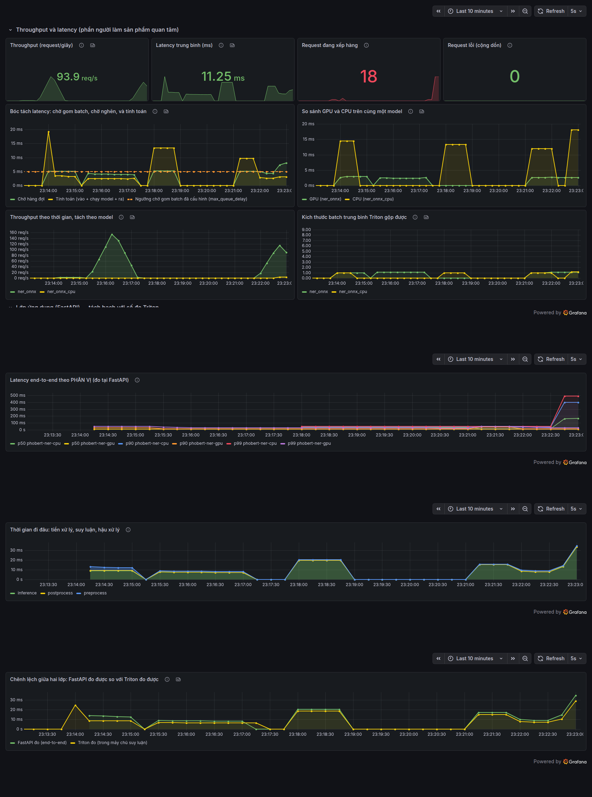

# Giám sát vận hành

Mở **http://localhost:3001** sau khi `docker compose up -d`. Dashboard đã cấu
hình sẵn, không cần đăng nhập.



## Hai lớp số đo, thu riêng

```
Triton  :8002/metrics  ──┐
                         ├──▶  Prometheus :9490  ──▶  Grafana :3001
FastAPI :8080/metrics  ──┘        (thu mỗi 5 giây)
```

Cố tình tách làm hai, vì mỗi bên chỉ nhìn thấy phần việc của mình:

| | Triton đo | FastAPI đo |
|---|---|---|
| Phạm vi | từ lúc nhận tensor tới lúc trả tensor | toàn bộ thời gian trong handler |
| Có tokenize không | **không** | có |
| Có gom span không | **không** | có |
| Dạng số đo | bộ đếm cộng dồn, chỉ ra **trung bình** | Histogram, ra **p50/p90/p99 thật** |
| Bóc tách được gì | queue, compute input/infer/output, batch | preprocess, inference, postprocess |

**Chỉ nhìn số đo Triton là thấy thiếu.** Đo trên chính hệ thống này, mỗi request
tới `phobert-ner-gpu`:

| Chặng | ms | % end-to-end |
|---|---|---|
| Tiền xử lý (tokenize) | 4,70 | **33,6%** |
| Suy luận (gồm cả 5 ms chờ gom batch) | 9,02 | 64,5% |
| Hậu xử lý (gom span) | 0,10 | 0,7% |
| **Tổng tại FastAPI** | **13,98** | 100% |

Một phần ba thời gian nằm ở tokenize, hoàn toàn vô hình với Triton. Nếu chỉ nhìn
dashboard Triton thì sẽ đi tối ưu model hoặc mua thêm GPU, trong khi thứ đáng sửa
là code Python.

Cả hai cấu hình đều là **file trong repo** (`services/monitoring/`), không phải
bấm tay trong giao diện. Dashboard vẽ tay sống trong cơ sở dữ liệu của Grafana:
không xem lại được lịch sử thay đổi, và dựng môi trường mới là mất sạch.

---

## Đọc từng biểu đồ

| Biểu đồ                         | Đọc thế nào                                                                 |
| ---------------------------------- | ------------------------------------------------------------------------------- |
| **Thông lượng**           | đứng yên dù thêm người dùng = đã bão hoà                            |
| **Độ trễ trung bình**    | trung bình che mất phần đuôi, đọc kèm p99 ở phần đo tải             |
| **Request đang xếp hàng** | cảnh báo**sớm nhất**: nó dựng lên trước khi độ trễ kịp tăng |
| **Request lỗi**             | bất kỳ giá trị nào > 0 cũng đáng điều tra                             |
| **Mức sử dụng GPU**       | GPU thấp mà độ trễ cao = nghẽn ở chỗ khác, đừng mua thêm GPU        |
| **Bộ nhớ GPU**             | cạn trước nhất khi tăng bản sao model hoặc kích thước batch           |
| **Điện năng**             | quy đổi trực tiếp ra chi phí vận hành                                    |

### Biểu đồ quan trọng nhất: bóc tách latency

Tách tổng thời gian thành **chờ hàng đợi (queue)** và **tính toán (compute)**, kèm
một đường ngang ở mức `max_queue_delay` đã cấu hình (5 ms).

> **Đọc kỹ đường ngang đó trước khi kết luận.** Queue cao KHÔNG mặc nhiên là quá
> tải. Với dynamic batching, mỗi request chờ tối đa `max_queue_delay` để Triton gom
> thêm request khác vào cùng batch. Khi tải thấp thì **không có ai để gom**, nên
> request chờ đủ 5 ms rồi mới chạy, và queue thường **cao hơn** compute. Đó là do
> cấu hình, không phải sự cố.

Số đo trên chính hệ thống này, cùng một câu, latency trung bình mỗi request:

| Cách gửi | Queue | Compute | Batch trung bình |
|---|---|---|---|
| từng request lẻ, cách nhau 250 ms | 5106 us | 1902 us | 1,00 |
| 16 luồng đồng thời | **1482 us** | 2023 us | 3,97 |

Có tải thì queue **giảm 3,4 lần**, vì batch đầy sớm nên không phải chờ hết 5 ms.
Đổi `max_queue_delay` xuống 500 us thì queue tụt còn 664 us: nó bám sát tham số
cấu hình, không bám theo mức tải.

Vậy đọc biểu đồ như sau:

| Quan sát | Nghĩa là | Việc phải làm |
|---|---|---|
| queue bám sát đường 5 ms, batch bằng 1 | tải thấp, đang chờ gom batch | không có gì phải làm |
| queue **vượt hẳn** đường 5 ms và tăng dần | nghẽn thật do quá tải | thêm bản sao model hoặc thêm máy |
| queue thấp, compute cao và phẳng | model chậm | tối ưu, lượng tử hoá, đổi phần cứng |
| cả hai đều thấp mà người dùng vẫn kêu chậm | nghẽn ngoài Triton | xem tokenize, mạng, tiến trình web |

Muốn bỏ hẳn 5 ms chờ đó thì đặt `max_queue_delay_microseconds: 0` trong
`config.pbtxt`: latency khi tải thấp giảm ngay, đổi lại throughput khi tải cao kém
đi vì gần như không gộp được batch. Đây đúng là đánh đổi latency với throughput.

Đường compute cộng cả ba phần Triton đo riêng: chuẩn bị tensor vào, chạy model,
lấy tensor ra. Chỉ vẽ phần chạy model là bỏ sót khoảng 8% thời gian.

> **Mọi con số latency trên dashboard là TRUNG BÌNH**, vì Triton chỉ xuất bộ đếm
> cộng dồn chứ không xuất histogram. Trung bình che mất phần đuôi. Muốn p50, p95,
> p99 thì lấy từ `load_test/` (Locust đo phía client và có đủ phân vị).

### So sánh GPU với CPU

Hai đường là thời gian tính toán thật của `ner_onnx` (GPU) và `ner_onnx_cpu`
(CPU). Cùng file trọng số, cùng runtime, cùng máy chủ. Khoảng cách giữa chúng là
**giá trị thật của GPU trong bài toán này**, đo trên hệ thống của mình.

### Kích thước batch trung bình

Bằng 1 nghĩa là gộp batch động không phát huy tác dụng: request đến quá thưa nên
không có gì để gộp. Tự gọi API vài lần rồi thấy bằng 1 là **đúng**, không phải
hỏng. Muốn thấy gộp batch hoạt động thì phải có tải thật.

---

### Hàng panel lớp ứng dụng (FastAPI)

| Panel | Trả lời câu gì |
|---|---|
| **Latency end-to-end theo phân vị** | p50/p90/p99 THẬT. Đây là thứ số đo Triton không cho được |
| **Thời gian đi đâu** | chậm vì model hay vì code Python? Ba chặng xếp chồng lên nhau |
| **Chênh lệch giữa hai lớp** | khoảng cách giữa đường FastAPI và đường Triton chính là chi phí lớp ứng dụng |

Panel cuối là panel đáng nhìn nhất khi hệ thống chậm: khoảng cách rộng ra mà
đường Triton vẫn phẳng nghĩa là nút thắt nằm ở tokenize hoặc hậu xử lý, không
phải ở model.

---

## Bài tập nên làm

Mở dashboard ở một cửa sổ, chạy đo tải ở cửa sổ khác:

```bash
USERS=150 SPAWN_RATE=30 RUN_TIME=60s MODELS="phobert-ner-gpu" bash load_test/run_stress_test.sh
```

Ba thứ xảy ra cùng lúc, theo đúng thứ tự: thông lượng **chạm trần**, đường **hàng
đợi** dựng lên, độ trễ tăng theo. Đó là **điểm bão hoà**. Sau điểm đó, mỗi người
dùng thêm vào chỉ làm dài thêm hàng đợi.

Chạy lại với `MODELS="phobert-ner-cpu"` rồi so hai lần đo.

---

## Đặt cảnh báo

```promql
# Có lỗi. Ngưỡng bằng 0 vì lỗi suy luận không bao giờ là bình thường.
sum(rate(nv_inference_request_failure[5m])) > 0

# Hàng đợi dựng lên. Cảnh báo SỚM: xảy ra trước khi người dùng kịp thấy chậm.
sum(nv_inference_pending_request_count) > 5

# Độ trễ vượt cam kết. Ngưỡng lấy từ cam kết với người dùng, không phải từ
# con số hệ thống đang đạt được.
sum(rate(nv_inference_request_duration_us[5m]))
  / clamp_min(sum(rate(nv_inference_request_success[5m])), 0.001) / 1000 > 100
```

Nguyên tắc: **cảnh báo phải gắn với thứ người dùng cảm nhận được**, không phải
với thứ dễ đo. "GPU đang dùng 90%" gần như vô dụng: GPU cao mà mọi người vẫn được
phục vụ đúng hạn là dùng hiệu quả, không phải sự cố.

---

## Khi dashboard trống

Lần ngược đường đi của số đo, kiểm từng khâu:

```bash
curl -s localhost:8002/metrics | head                        # Triton có xuất không
curl -s localhost:9490/api/v1/targets | python3 -m json.tool  # Prometheus thu được không
curl -s localhost:3001/api/datasources                        # Grafana có nguồn chưa
```

Nguyên nhân hay gặp nhất: **chưa có lưu lượng nào**. Triton chỉ sinh metrics khi
có request; panel trống là đúng nếu bạn chưa gọi API lần nào. Chi tiết:
[TROUBLESHOOTING.md](TROUBLESHOOTING.md) mục E09.

Cổng mặc định là **3001** và **9490**, cố tình lệch khỏi 3000/9090 vì nhiều máy
đã có sẵn stack giám sát khác. Vẫn trùng thì đổi `GRAFANA_PORT` và
`PROMETHEUS_PORT` trong `.env`.
